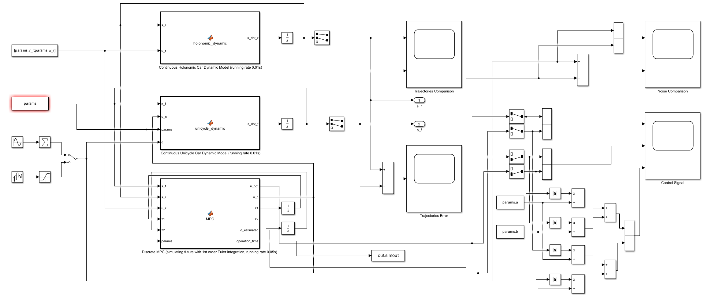

# Disturbance Rejection MPC for Tracking of Wheeled Mobile Robot (Refined Version)
It is a MATLAB/Simulink implementation for [**Columbia EE6907_001 TPCS-ELEC & COMPUT ENGINEERING: Model Predictive Control (Spring 2025)**](https://www.columbia.edu/~ja3451/courses/e6602.html) final project done by ***Zewen (Anthony) Chen*** and ***Xinhe "Carl" Yang***. A technical presentation slide is also inclued in this repository. Some result figures are inclued in [Result Floder](./Result/)

**$${\color{red}This\enspace project\enspace got\enspace full\enspace credit\enspace in\enspace the\enspace course.}$$**

## Project Overview
This project is a refined reproduction using MATLAB/Simulink for the paper:
> **"Disturbance Rejection MPC for Tracking of Wheeled Mobile Robot"**  
> by Sun Z, Xia Y, Dai L, et al., IEEE/ASME Transactions On Mechatronics 2017
> 📄 [IEEE Xplore](https://ieeexplore.ieee.org/abstract/document/8054727)

This project **reproduces**:

- MATLAB implementation for the algorithm from the original DRMPC paper
- Discrete simulation in MATLAB with the same setting from the original DRMPC paper
- Comparison of tracking performance of DRMPC at different DOBs under discrete simulation


This project **refines** and **extends**:

- Simulink implementation for continuous simulation and corresponding tracking performance comparison
- **Shortened Horizon Refinement** for Real-time Implementation
- **Asynchronous Control Simulation**, closer to a real continuous system
- Performance Under **Nonharmonic (Gaussian) Noise**

#### Simulink Continuous Simulation



In Simulink, we used a discrete DRMPC controller, which is implemented in a continuous mobile robot system.

#### Shortened Horizon Refinement

In the original paper uses a 80-step horizon, whose solving time is much higher than then samping time in each step hence meaningless for real-time implementation. So, we shorten the horzion to 8 steps to achive real-time control while slacking some constraints to guarantee the feasibility for DRMPC.

#### Asynchronous Control Simulation

This is a one-step further extension, in which we let the simulating time in Simulink much smaller than the sampling time for DRMPC, whichs simulates a closer continuous environment.

## How to use

If you wan to see the performace of DRMPC in discrete world, run [DRMPC_Plus.m](./DRMPC_Plus.m).

If you wan to see the performace of DRMPC in discrete world, run [Params_for_Simulink.m](./Params_for_Simulink.m) and open [Continuous_Model.slxc](Continuous_Model.slxc) in Simulink and run simulation, then see the visualization in the scopes.

### Chaning Settings

#### Noise Parameters
If you want to change the parameters for harmonic disturbance, change following in DRMPC_Plus.m and Params_for_Simulink.m
```
params.A = [0.0024 0.0019]; 
params.f = [2.5 1.25]; 
params.phi = [1 pi/2];
```
where params.A refers to amplitudes, params.f refers to frequencies, and params.phi refers to phases.

If you want to see the performance of Gaussian noise in Simulink, double click the middle left switch in Simulink model.

#### DOBs Parameters
If you want to switch the type of DOB, change
```
params.dob_type = 1;
```
in to 0 (no DOB), 1 (DOB type 1), or 2(DOB type 2).
If you want to change the parameters for DOB type 1, change the L1 gain:
```
params.L1 = 15;
```
If you want to change the parameters for DOB type 2, change the poles:
```
params.poles = [-11 -12 -11.5 -13];
```

> [!Warning]
> Make sure L1<2/δ for DOB1 and all poles stay in the region [-2/δ, 0] for DOB2 to ensure stabilities for DOBs, where δ is the sampling time for DRMPC, you can find more analytical explanations in the 9th-page of the presentation slide.

#### Simulation Parameters
If you want to change the settings for simulation, change
```
params.dt = 0.05;
params.T_sim = 15;
params.T_horizon = .4;
params.N = params.T_horizon/params.dt;
params.N_sim = params.T_sim/params.dt;
```
where params.dt refers to sampling time for DRMPC, params.T_horizon refers to the time of horizon, and params.T_sim refers to the total simulation time.

## Live Demo
 